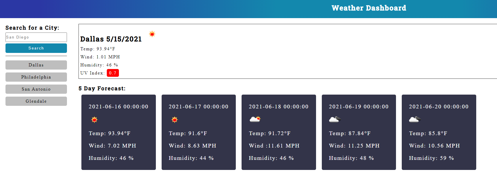

# Weather-Dashboard
[https://jaredc71.github.io/Weather-Dashboard/](https://jaredc71.github.io/Weather-Dashboard/)

#### This project was built with HTML, CSS, Javascript, and the OpenWeatherMap API. When the user starts the application, they are met with a search field. The user then inputs a city name into the search field and the citys current weather and the weather over the next five days is displayed onto the page. The name of the city is then stored away in search history underneath the submission button. When an item in the search history is clicked, the application will display the weather data for that city. If the UV index of the city is above .55, it will display red. If the UV index is below .55, it will display green. 
